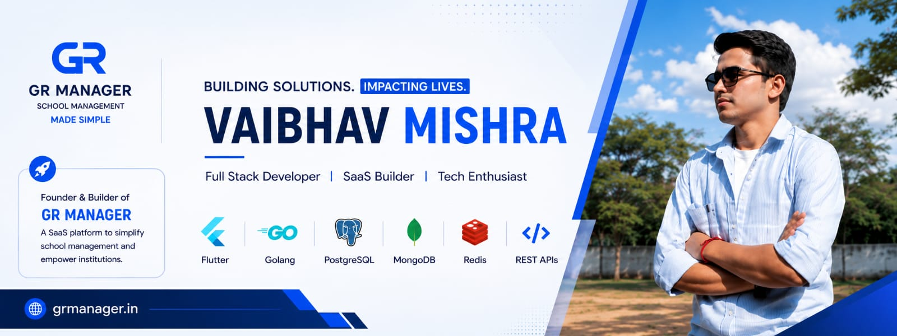
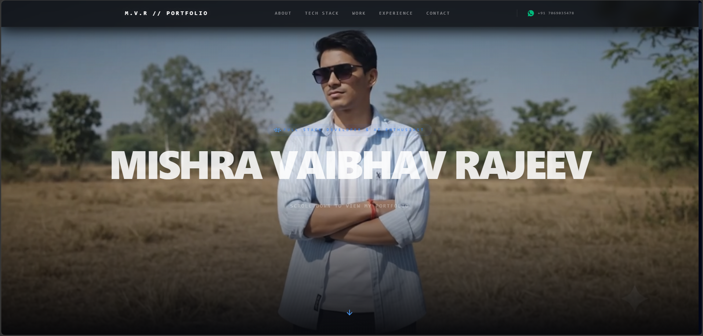

<!-- Banner - Clickable, opens Portfolio -->
<a href="https://vaibhavmishra-red.vercel.app" target="_blank">
  
</a>

<div align="center">

  <!-- Typing Animation -->
  <a href="https://git.io/typing-svg">
    
  </a>

</div>

---

## 🙋‍♂️ About Me

```yaml
Name:       Vaibhav Mishra
Role:       Full Stack Developer | SaaS Builder | Tech Enthusiast
Education:  B.Tech - Computer Engineering (3rd Year)
Location:   India 🇮🇳
Email:      vaibhavmi2026@gmail.com
Fun Fact:   "The most loyal creation by God is life's problems — they never leave you at any cost 😂"
```

- 🔭 Currently building **[GR Manager](https://grmanager.in/)** — A SaaS platform for school management
- 🌱 Learning **Python for AI/ML**
- 👯 Open to collaborate on new & exciting projects
- 📫 Reach me via socials below or email me at **vaibhavmi2026@gmail.com**

---

## 🌐 Connect With Me

<div align="center">

<table>
  <tr>
    <td align="center" width="180">
      <a href="https://instagram.com/vaibhav_mishra_2026" target="_blank">
        
        <br /><b>@vaibhav_mishra_2026</b>
      </a>
    </td>
    <td align="center" width="180">
      <a href="https://linkedin.com/in/vaibhav-mishra-b063163b2" target="_blank">
        
        <br /><b>Vaibhav Mishra</b>
      </a>
    </td>
    <td align="center" width="180">
      <a href="https://x.com/tech_mishra" target="_blank">
        
        <br /><b>@tech_mishra</b>
      </a>
    </td>
    <td align="center" width="180">
      <a href="https://reddit.com/user/tech_mishra" target="_blank">
        
        <br /><b>u/tech_mishra</b>
      </a>
    </td>
  </tr>
  <tr>
    <td align="center" width="180">
      <a href="https://youtube.com/@@mishra_vaibhav_2026" target="_blank">
        
        <br /><b>@mishra_vaibhav_2026</b>
      </a>
    </td>
    <td align="center" width="180">
      <a href="mailto:vaibhavmi2026@gmail.com" target="_blank">
        
        <br /><b>vaibhavmi2026@gmail.com</b>
      </a>
    </td>
    <td align="center" width="180">
      <a href="https://vaibhavmishra-red.vercel.app" target="_blank">
        
        <br /><b>My Portfolio</b>
      </a>
    </td>
    <td align="center" width="180">
      <a href="https://grmanager.in" target="_blank">
        
        <br /><b>grmanager.in</b>
      </a>
    </td>
  </tr>
</table>

</div>

---

## 🖥️ My Portfolio

<div align="center">
  <a href="https://vaibhavmishra-red.vercel.app" target="_blank">
    
  </a>
  <br />
  <a href="https://vaibhavmishra-red.vercel.app" target="_blank">
    
  </a>
</div>

---

## 🚀 Featured Project — GR Manager

<div align="center">

  <a href="https://grmanager.in" target="_blank">
    
  </a>

  <br /><br />

  <a href="https://grmanager.in" target="_blank">
    
  </a>

</div>

> **GR Manager** is a SaaS platform to simplify school management and empower institutions.  
> 🔗 Live at [grmanager.in](https://grmanager.in)

---

<!-- Snake Game Animation -->
<div align="center">
  
</div>

---

## 💻 Tech Stack

<div align="center">

### 👨‍💻 Languages

<table>
  <tr>
    <td align="center" width="96">
      
      <br /><b>C</b>
    </td>
    <td align="center" width="96">
      
      <br /><b>C++</b>
    </td>
    <td align="center" width="96">
      
      <br /><b>Dart</b>
    </td>
    <td align="center" width="96">
      
      <br /><b>Go</b>
    </td>
    <td align="center" width="96">
      
      <br /><b>Java</b>
    </td>
    <td align="center" width="96">
      
      <br /><b>JavaScript</b>
    </td>
    <td align="center" width="96">
      
      <br /><b>Python</b>
    </td>
  </tr>
</table>

### 🌐 Frontend

<table>
  <tr>
    <td align="center" width="96">
      
      <br /><b>HTML5</b>
    </td>
    <td align="center" width="96">
      
      <br /><b>CSS3</b>
    </td>
    <td align="center" width="96">
      
      <br /><b>React</b>
    </td>
    <td align="center" width="96">
      
      <br /><b>Next.js</b>
    </td>
    <td align="center" width="96">
      
      <br /><b>Flutter</b>
    </td>
    <td align="center" width="96">
      
      <br /><b>React Native</b>
    </td>
    <td align="center" width="96">
      
      <br /><b>Tailwind</b>
    </td>
    <td align="center" width="96">
      
      <br /><b>Vite</b>
    </td>
  </tr>
</table>

### ⚙️ Backend & Tools

<table>
  <tr>
    <td align="center" width="96">
      
      <br /><b>Node.js</b>
    </td>
    <td align="center" width="96">
      
      <br /><b>Express</b>
    </td>
    <td align="center" width="96">
      
      <br /><b>Socket.io</b>
    </td>
    <td align="center" width="96">
      
      <br /><b>JWT</b>
    </td>
    <td align="center" width="96">
      
      <br /><b>NPM</b>
    </td>
    <td align="center" width="96">
      
      <br /><b>Nodemon</b>
    </td>
  </tr>
</table>

### 🗄️ Databases

<table>
  <tr>
    <td align="center" width="96">
      
      <br /><b>MongoDB</b>
    </td>
    <td align="center" width="96">
      
      <br /><b>PostgreSQL</b>
    </td>
    <td align="center" width="96">
      
      <br /><b>MySQL</b>
    </td>
    <td align="center" width="96">
      
      <br /><b>Redis</b>
    </td>
    <td align="center" width="96">
      
      <br /><b>SQLite</b>
    </td>
    <td align="center" width="96">
      
      <br /><b>Firebase</b>
    </td>
    <td align="center" width="96">
      
      <br /><b>Supabase</b>
    </td>
  </tr>
</table>

### ☁️ Cloud & Deployment

<table>
  <tr>
    <td align="center" width="96">
      
      <br /><b>Firebase</b>
    </td>
    <td align="center" width="96">
      
      <br /><b>Vercel</b>
    </td>
    <td align="center" width="96">
      
      <br /><b>Render</b>
    </td>
    <td align="center" width="96">
      
      <br /><b>Netlify</b>
    </td>
  </tr>
</table>

### 🤖 AI/ML

<table>
  <tr>
    <td align="center" width="96">
      
      <br /><b>TensorFlow</b>
    </td>
    <td align="center" width="96">
      
      <br /><b>PyTorch</b>
    </td>
    <td align="center" width="96">
      
      <br /><b>NumPy</b>
    </td>
    <td align="center" width="96">
      
      <br /><b>Pandas</b>
    </td>
  </tr>
</table>

### 🛠️ Other Tools

<table>
  <tr>
    <td align="center" width="96">
      
      <br /><b>Git</b>
    </td>
    <td align="center" width="96">
      
      <br /><b>GitHub</b>
    </td>
    <td align="center" width="96">
      
      <br /><b>Actions</b>
    </td>
    <td align="center" width="96">
      
      <br /><b>Postman</b>
    </td>
    <td align="center" width="96">
      
      <br /><b>Figma</b>
    </td>
    <td align="center" width="96">
      
      <br /><b>Canva</b>
    </td>
  </tr>
</table>

</div>

---

## 📊 GitHub Stats

<div align="center">

  
  
  <br />
  

</div>

---

## 🏆 GitHub Trophies

<div align="center">

  

</div>

---

## 📈 Activity Graph

<div align="center">

  

</div>

---


<div align="center">

  [](https://visitcount.itsvg.in)

  <br />

  **⭐ If you like my work, consider giving a star to my repos!**

  <br />

  <sub>Designed with ❤️ by **Vaibhav Mishra**</sub>

</div>
